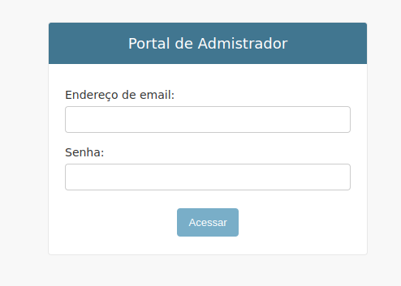
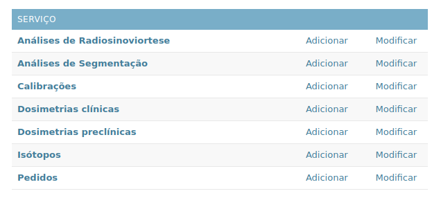
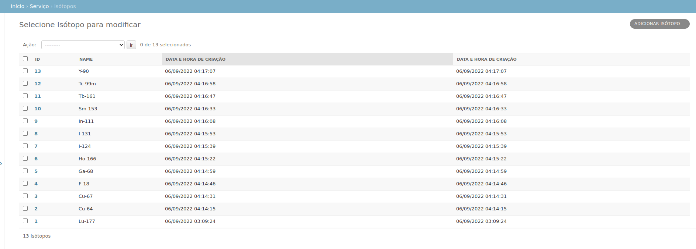
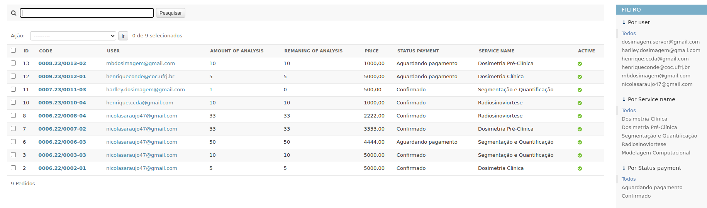
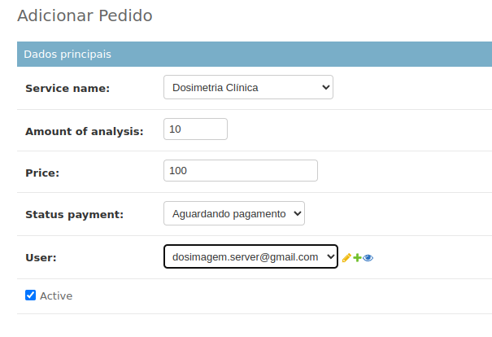
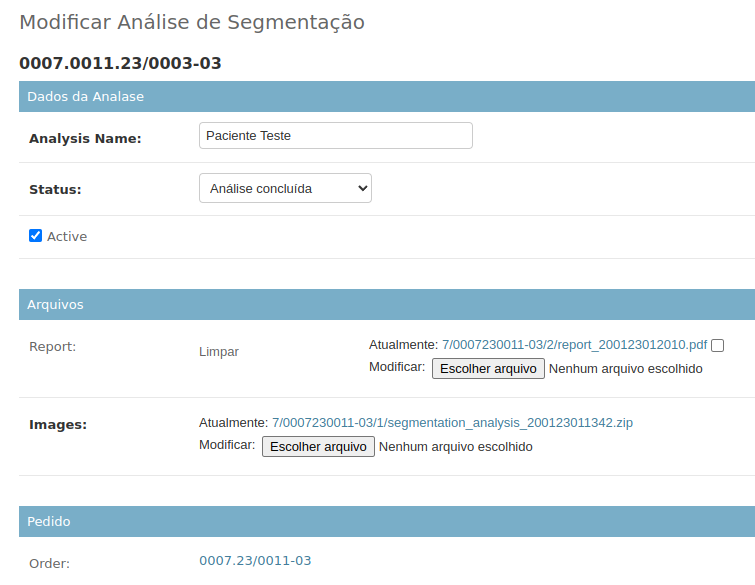
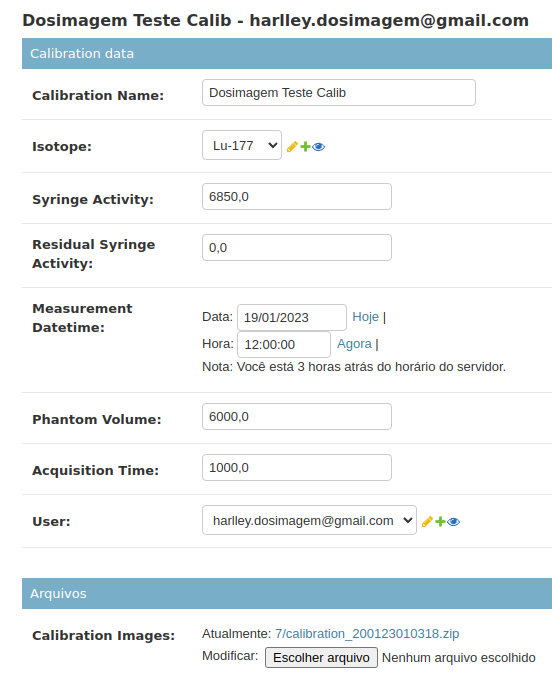
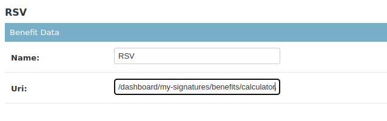
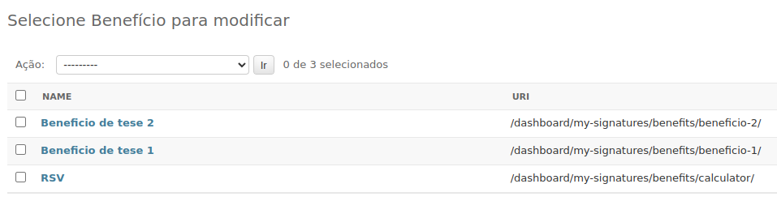
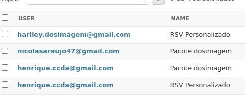

# Área administrativa

Principais funcionalidades da área administrativa da plataforma

## Acessando a plataforma
---

Para se logar na área administrativa da plataforma é necessário um usuário com permissões adminitrativas.

Para acessar a pagina de login base acessar a rota [/dosimagem/admin/](https://api.dosimagem.dev.br/dosimagem/admin/)

## Funcionalidades da plataforma

Aba serviço temos as seguintes informações:

* Análises de Radionoviortese
* Análise de Segmentação
* Calibrações
* Dosimetria clínicas
* Dosimetria preclínicas
* Isótopos
* Pedidos

### Criação de isótipos
---

Em isótopos temos uma lista dos isotopos que são mostrados nas analises clínicas e pre-clínicas

Caso se queira adicionar um novo isótopo basta clicar no botão adicionar.

### Criação de novos pedidos

Em pedidos temos a lista de pedidos contratados pelos os usários

Para cria um pedido basta clicar no botão adicionar.

Nele temos os campos:

* Service name: Nome do seriço contratado
* Amount of Analysis: Quantidade de analises no pedido contratado
* Price: Preço total
* Payment status: Estatus de pagamento
* User: Usuario dono do pedido

### Acessando informações da Analises

Clicando no nome da análise podemos ver as informações de uma determinada analise.

Inicialmente o campo do relátorio estará fazio, apenas depois que a analise estiver concluida que se deve colocar se deve adicionar o `.pdf`. Assim que adiciona o arquivo ficará disponivel para o usuário fazer o `donwload`.

### Calibrações

Clicando no nome da calibração podemos ver as calibração cadastra do usuario.

### Códigos

* Pedido: `usuario_id`.`ano`/`pedido_id`-`códido do serviço`
* Dosimetrias: `usuario_id`.`pedido_id`.`isotopo`.`ano`/`analise_id`-`códido do serviço`
* Radionoviortese: `usuario_id`.`pedido_id`.`isotopo`.`ano`/`analise_id`-`códido do serviço`
* Segmentação: `usuario_id`.`pedido_id`.`ano`/`analise_id`-`códido do serviço`

Os códigos dos servições são:

* Dosimetrias clínica: `01`
* Dosimetrias preclínica: `02`
* Segmentação: `03`
* Radionoviortese: `04`
* Modelagem computacional: `05`

### Habilitando a calculadora

A calculadora foi adicionado como um beníficio.

É possivel ter varios benificios

Os benificios por suas vez estão associodos a uma assinatura.

Uma assinatura podem mais de um benificio é um usuário pode ter mais de uma assinatura.
